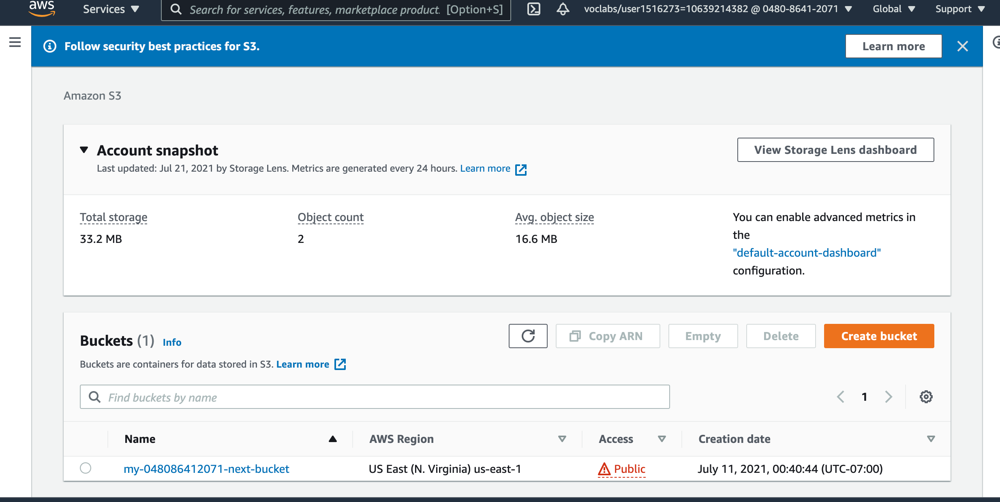
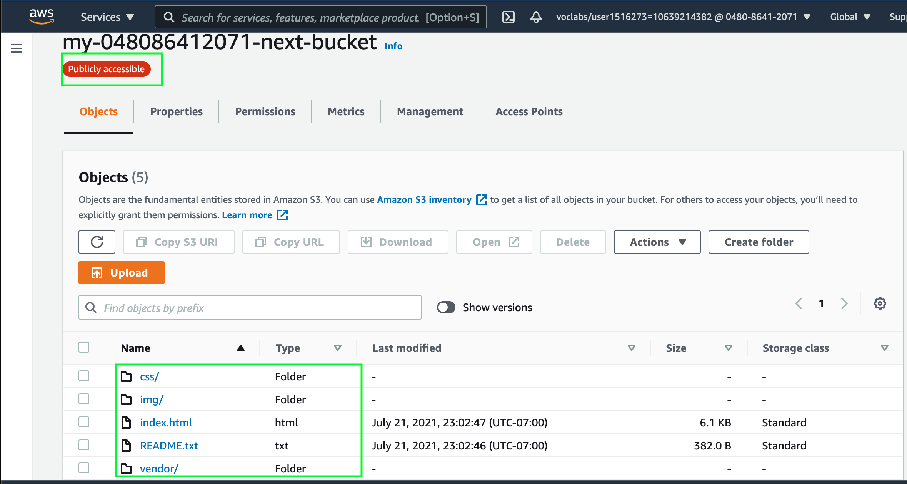
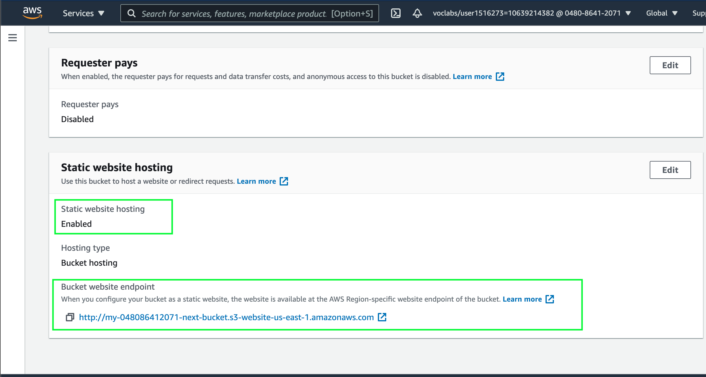
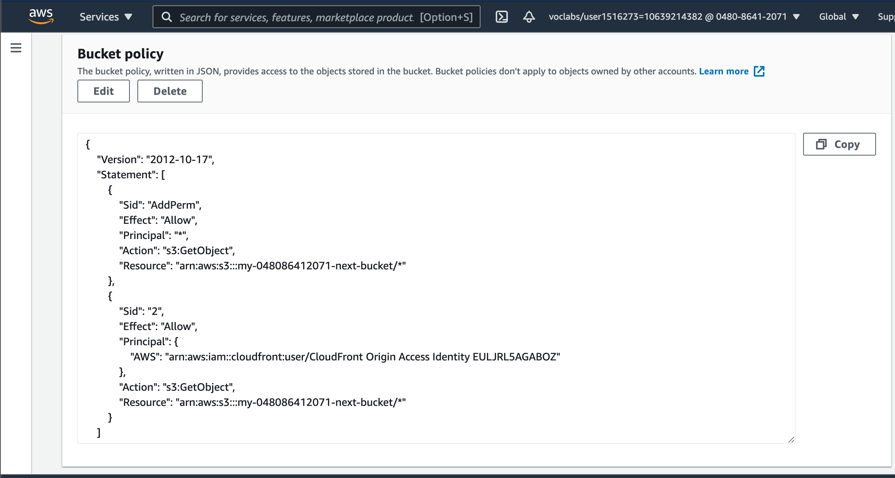
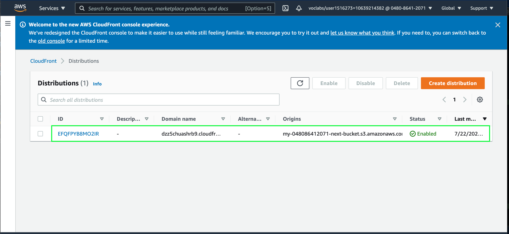
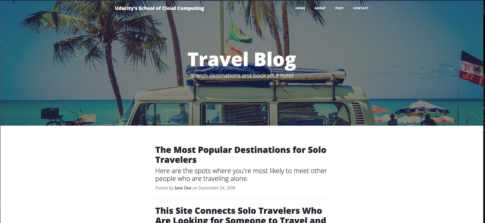

<!-- ABOUT THE PROJECT -->
## About The Project 1

<br>

<h3 align="center"> Deploy Static Website on AWS </h3>
<br />
There're topics covered in this project:

* learn how to create S3 bucket and configute it
* learn how to destribute a static website (set of html,css,img files) using CloudFront to speed up an access and get a low latancy benefits)
<br />
<br />

<h3><b>It's required to go through the following steps:</b></h3>


1. Create a public S3 bucket and upload the website files to the bucket.
2. Enable website hosting for the bucket and secure it using IAM policies.
3. Attach CloudFront to speed up content delivery using AWS’s content distribution network service
4. Provide an access the website in a browser using the unique CloudFront endpoint.

<br /><br />
<h3><b>STEPS are DONE (with screenshots):</b></h3>

1. A public S3 bucket created 
<br />
<p align="center">
  <a href="https://github.com/serglit72/devops/">
    
  </a>
<br />
<br />


2. Static Website files downloaded.
<br />
<p align="center">
  <a href="https://github.com/serglit72/devops/">
    
  </a>
<br />
<br />

3. In the bucket settings just enabled "website hosting" feature
<br />
<p align="center">
  <a href="https://github.com/serglit72/devops/">
    
  </a>
<br />
<br />

4. Secured the public access using IAM policies settings

<br />
<p align="center">
  <a href="https://github.com/serglit72/devops/">
    
  </a>
<br />
<br />

5. CloudFront  domain is attached to the bucket
<br />
CloudFront distribution domain name:	
<br />
```sh
dzz5chuashrb9.cloudfront.net
```
<br />
<p align="center">
  <a href="https://github.com/serglit72/devops/">
    
  </a>
<br />
<br />

6. Now the static website is available from web browser via website-endpoint : 
```sh
http://my-048086412071-next-bucket.s3-website-us-east-1.amazonaws.com
```

Try it. You have to see that static website via browser.
<br />
<br />
<p align="center">
  <a href="https://github.com/serglit72/devops/">
    
  </a>
<br />
<br />

7. Access the bucket object via its S3 object URL:
```sh
https://my-048086412071-next-bucket.s3.amazonaws.com/index.html
```

